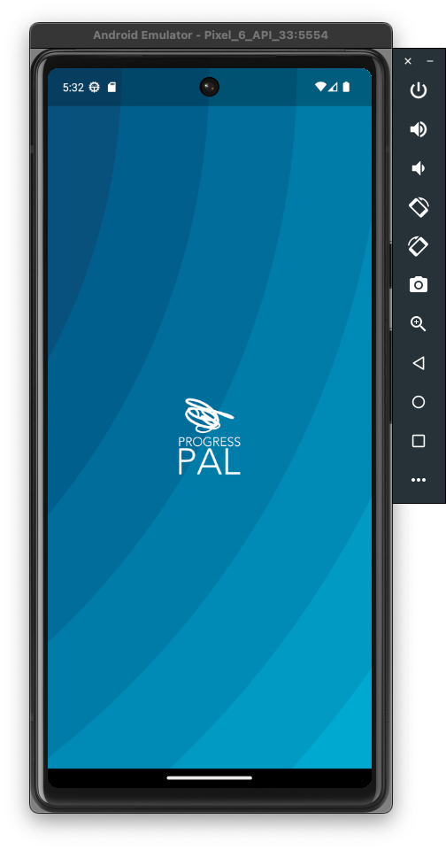
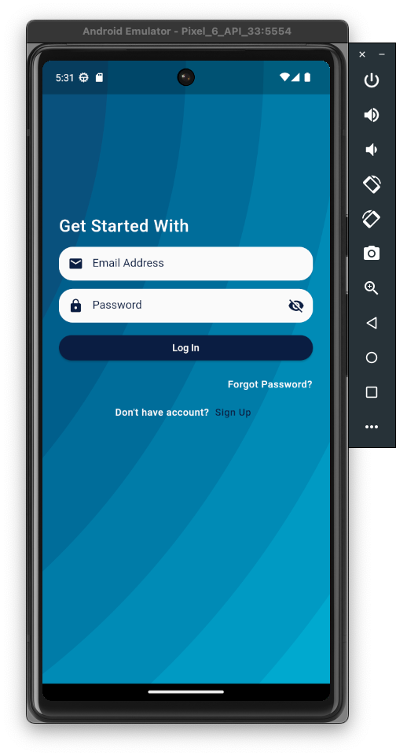
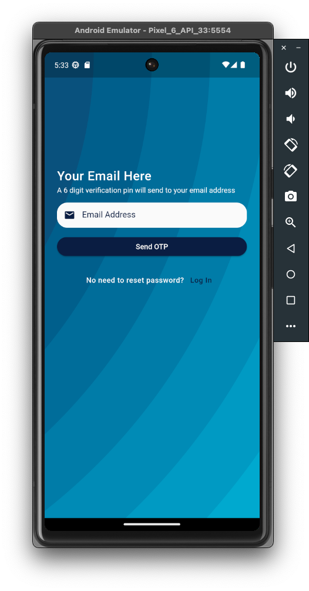
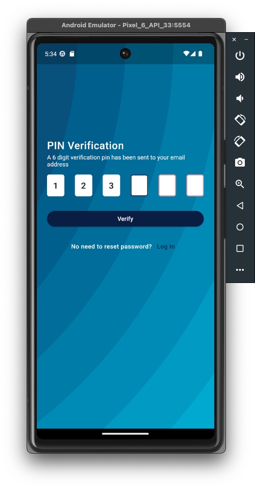
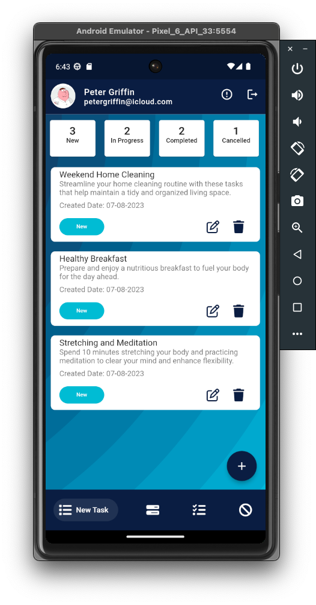
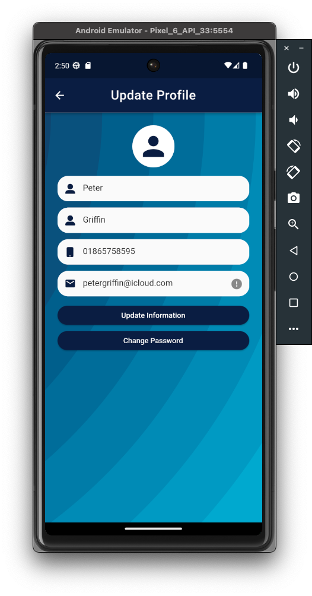
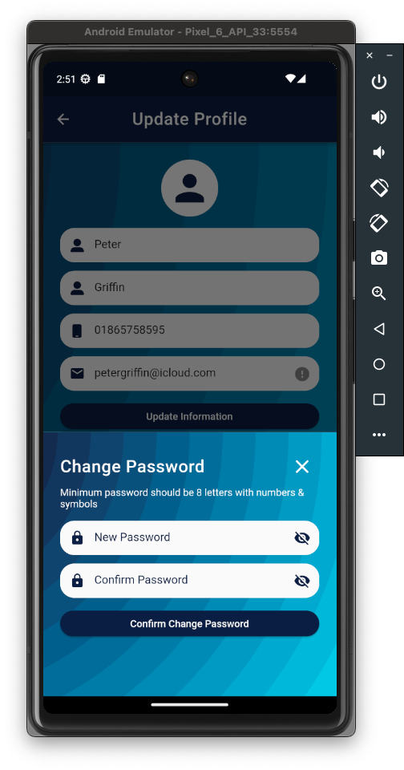

## Progress Pal

## Progress Pal: The Ultimate Task Manager in Flutter!

Elevate your productivity with Progress Pal, a meticulously crafted task manager application designed to streamline your journey towards achieving your goals. With its sleek design and intuitive user interface, Progress Pal redefines task management, making it an indispensable companion for both personal and professional endeavors.

**Seamless Onboarding:**
Embark on your productivity journey by creating your account through our user-friendly sign-up option. Forgot your password? No worries! Our secure log-in with password recovery feature ensures that you're always in control of your account.

**Empowering Profile Updates:**
Customize your user experience and keep your information up-to-date effortlessly. The profile update option lets you modify your details and ensure your personal touch on the app.

**Effortless Task Management:**
Add tasks effortlessly and embark on the path to success. The app initiates with a default category called "New," ensuring a swift start to your task list. With just a tap, transform your tasks into achievements.

**Dynamic Task Status Updates:**
Progress Pal empowers you to manage your tasks dynamically. Move tasks between the "In Progress," "Completed," and "Cancelled" statuses effortlessly. A convenient bottom sheet pops up, allowing you to seamlessly shift tasks to the desired status.

**Insightful Summary Card:**
Stay on top of your game with the Summary Card feature. It provides a quick snapshot of task distribution across the "In Progress," "Completed," and "Cancelled" categories. What's more? This handy card is accessible from any of the four main pages, keeping you informed at all times.

Progress Pal isn't just an app; it's a tool that adapts to your rhythm, empowering you to make progress every step of the way. Whether you're a busy professional, a dedicated student, or someone striving to manage daily tasks effectively, Progress Pal caters to your unique needs.

Experience the future of task management. Download Progress Pal today and unlock a world of organization, efficiency, and accomplishment. Your journey to success begins here.
